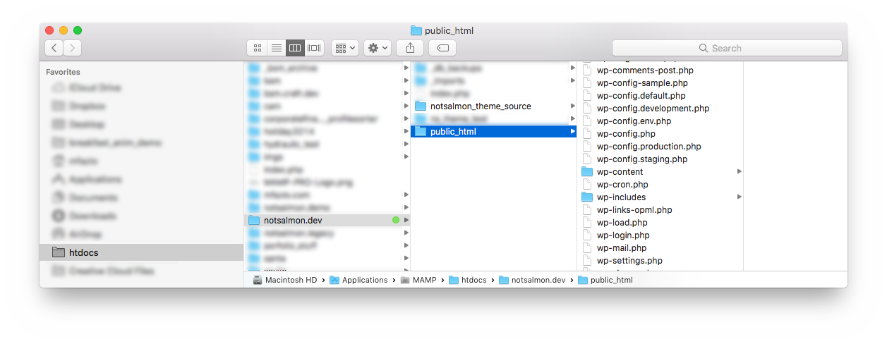

# NotSalmon Website Local Development

This guide will help you start from scratch and get a local development version of the notsalmon.com website up and running. This repo includes the source files (and build system) required to generate the **Pressive-Child theme** used on the [NotSalmon.com](https://www.notsalmon.com) website.

I can make myself available for an onboarding/handoff call if you think its necessary, however I will not be available for future support. If you think you'd like to do a 30-60 minute Zoom meeting, please let Karen know and she will contact me for scheduling. I typically am only available on weekends, but I can make special exceptions for Fridays after 2pm (excluding July 4th). 


## Prerequisites
 
- You must have a working knowledge of Wordpress, website and local development, command-line usage, and an understanding of "why we use build systems" in the first place.
- You must have admin access to notsalmon.com as well as filesystem access to the LightningBase hosting account (cPanel, SSH, FTP, etc) in order to pull the database and download some files where/when applicable.
- Download and install a local development environment that supports Linux, Apache, MySQL and PHP (LAMP) such as [MAMP](https://www.mamp.info/en/mac/), [Local by FlyWheel](https://localwp.com/), etc.
- The local build system requires [NodeJS](https://nodejs.org/en/). It is recommended (but not required) that you download and install the [Node Version Manager](https://github.com/nvm-sh/nvm) (NVM) in order to specify which version of NodeJS the build system is stable. A `.nvm` file is also included in this repo for reference.

## Important notes before you get started

**This build system makes no assumptions regarding deployment workflow. Meaning, this repo has no mechanism for deploying to staging or production servers, etc**

This build system is fully functional and tested. However, it is at the sole discretion of next developer to determine how best to develop notsalmon.com moving forward, and therefore this system should be considered a working starting point for a future preferred workflow. For example, a working `.htaccess` file is included to get you started quickly, but may not work as intended given your development environment of choice. Instead, it is recommended that you create and use your own `.htaccess` file that best fits into your workflow.

This build system is fully self-contained and does not include any external/cloud build systems, pre/post processors, or "push-to-deploy" mechanisms. All files are built locally, and it is up to the developer to determine how best to deploy the built project files.

This build system was created in 2017 and continues to be a stable working environment. However, there are some components that have not been updated in some time and could benefit from a proper update if applicable. For example, this build system uses Gulp version 3 and could be updated relatively easily to the more modern Gulp4 or even migrated to WebPack. This build system also uses Bower for only two components, and could very easily be updated to use Yarn or NPM instead. Or, using this build system as a guide, the entire system could be rebuilt using entirely Webpack.

**STAGING**

Previously, there used to be a **staging.notsalmon.com** website set up, but it was removed due to LightningBase hosting filesystem storage limits and the associated costs. It is at the sole descretion of the next developer to create their own deployment workflow. A new staging environment can be set up easily as long as it fits within the agreed hosting cost constraints.

**DOCUMENTATION**

This README documentation is specific to local development, this repo only, and intended to be thorough enough to get everything up and running. However, separate documentation (PDF) should have been provided that goes into more detail about the overall NotSalmon ecosystem, how-tos, and may also include additional detail about development concepts.

## 1. Install NotSalmon.com Wordpress site locally.

Please note, the following installation steps are intended to be used as an **overview**, and not absolute requirements. Your preferred development workflow may differ, so please feel free to substitute your own installation steps where applicable.

**Step 1: Download and install a local development environment.**  
Two great options for local development environments are [MAMP](https://www.mamp.info/en/mac/) and [Local by FlyWheel](https://localwp.com/). However, you can use whatever dev environment you like as long as it supports (at a minimum) the typical Wordpress ecosystem – PHP, MySQL and Apache...or simply, LAMP.

**Step 2: Create the local website directories.**  
Create a directory that will represent the local website's root directory named `notsalmon.dev`, and create a child directory named `/public_html`. Please note, these are the default values assumed by the build system out-of-the-box.

**Step 3: Create a virtual host entry for the local website.**  
Create a virtual host entry that will route `notsalmon.dev` url addresses to the `/public_html` directory you created. Please note, creating a virtual host is outside the scope of this documentation as its implementation can be very specific to your preferred development environment. For example, MAMP Pro and Local by FlyWheel can add virtual hosts directly through their UIs. Please note, notsalmon.com has SSL enabled. So, its a good idea to setup the local website using SSL (https) as well, however it is not required for the local site to work properly.

**Step 4: Clone this repo.**  
Clone this repo to be inside your `notsalmon.dev` directory, and immediately next to the `/public_html` directory. Once you have finished, your file structure should look similar to the below screenshot. Please note, this build system assumes these to be the default structures and naming, however, you can set this up however you prefer. If you choose to rename or move anything, or your workflow local development workflow utilizes symlinks, you will just need to update the Gulp build settings accordingly which can be found in `/gulp_tasks/settings/project.js`. 

**Step 5: Install Wordpress.**  
Download and install Wordpress in the `notsalmon.dev/public_html` directory, and create the corresponding MySQL database. In a typical Wordpress installation, this requires editing the `wp-config.php` file. Once complete, fire up your server and new Wordpress site to make sure everything is working before continuing. For more information, see the famous [5 minute Wordpress installation guide](https://wordpress.org/support/article/how-to-install-wordpress/)

```
db name: 	notsalmon_dev_db
user: 		root
password:	root
host: 		localhost
```

**Step 6: Export and download live database.**  
Export and download a copy of the current notsalmon.com database. Log in to the NotSalmon.com Wordpress Admin and navigate to `Tools > Migrate DB` and to the `Migrate` tab. Using this plugin, you can export the current database as well as replace all urls and paths to work with your current local installation. You can also save this export profile so it can be reused later without having to recreate it. For example, you may want to search and replace the items below.

Please note, this database contains roughly 10+ years worth of entries so it may take a considerable amount of time to export.

```
//notsalmon.com ==> 			notsalmon.dev
http://notsalmon.com ==> 		notsalmon.dev
https://notsalmon.com ==> 		notsalmon.dev
//www.notsalmon.com ==> 		notsalmon.dev
http://www.notsalmon.com ==> 	notsalmon.dev
https://www.notsalmon.com ==> 	notsalmon.dev
/home/notsalmo/public_html ==>	/path/to/your/local/public_html
```

**Step 7: Import database into dev environment.**  
In your development environment, dump all the contents of the previously created `notsalmon_dev_db` MySQL database and import the downloaded database into the empty `notsalmon_dev_db` database. 

**Step 8: Download and install required theme and plugins.**  
Download and install the required production files listed below. How you achieve this is up to you, but the easiest method is to log in to the LightningBase host account (via FTP, SSH, cPanel), manually download the required files, and place them in their corresponding directories. Please note, below I listed that you should also download the `pressive-child` directory. This is only to be able to verify that the local website is working properly before installing and configuring the build system. Once the build system is working, the entire `pressive-child` directory is subject to be overwritten when changes occur to the source files. **IMPORTANT:** The Pressive parent theme and many of the plugins are **premium** assets that were purchased and have their own accounts, keys and licenses. For many of them, you can aquire the license keys directly from the Wordpress admin. However, there are some that may require you to get access to those accounts from Karen so that you can retrieve the license keys yourself.

```
public_html/wp-content/themes/pressive
public_html/wp-content/themes/pressive-child
public_html/wp-content/plugins/** (download and install all plugins!)
```

**Step 9: Update and check .htaccess**  
A starter `.htaccess` file in this repo at `/src/htaccess/htaccess.txt`. Simple paste the contents of this file into the `.htaccess` file directly inside the Wordpress `/public_html` directory. **IMPORTANT:** The `.htaccess` file is also part of the build system. Once you get that up and running, the `.htaccess` contents will be **overwritten** with the content of `htaccess.txt` any time a change occurs to the file. So, once the build system is up and running, you should avoid editing the `.htaccess` file directly and instead use the `htaccess/htaccess.txt` file instead.

**Step 9: Download or proxy the /uploads directory.**  
At this point, you should be able to run and view the website, however, all of the image will appear broken. So, you know need to get all of the wordpress `/uploads` images working locally, and you have a few options. You could download the entire live `/uploads` directory locally, but it has roughly 10+ years worth of images in it and could take a very long time to download. 

Instead, you could edit the `.htaccess` file to rewrite any `notsalmon.dev/wp-content/uploads/**` urls to the corresponding `notsalmon.com/wp-content/uploads/**` url. If you went this route, you don't have to download any of the images locally. Instead, any time a local image is requested, it will just load the corresponding production/live image. **IMPORTANT:** Please refer back to Step 9 which states that the build system will overwrite the content of the `/public_html/.htaccess` file. So, until you get the build system running, you may want to edit both files as necessary. **ASIDE:** There is one more directory `public_html/downloads/` that also contains relevant media files. Depending on how you proceed, you should also download/connect this directory as well.

**Step 10: Fire it up!**  
If all went well, you should now be able to run and view a local version of notsalmon.com in your local development environment. Please note, we still have to connect the local build system. So, if for any reason the website is not currently working or being displayed properly, you should have the required skillset to troubleshoot on your own. I recommend that you get the local website running fully, and address any admin errors/notifications before proceeding.

## 2. Install and run the build system.

Please note, the below steps assume the default names, directory structures and locations to work properly right out-of-the-box. If you have renamed, moved, or restructured anything, you will need to edit and configure the build system accordingly.

```
cd path/to/repo/directory
```

**Step 11: Check Node.js version.**  
Be aware, this build system uses Gulp 3 and may not work in newer versions of Node.js. For this reason, it is recommended that you use Node Version Manager. There is a `.nvm` file in this repo that will auto-select the tested version of Node.js or it will prompt you to download a specific version when you run `nvm use`. If you are unable to run a compatible version of Node.js, you may need to port/migrate this build system to  something else like Webpack on your own.

**Step 12: Install Gulp-CLI globally.** 
The Gulp-CLI utility needs to be installed globally. Again, you need to ensure you are running the proper version of Node.js before continuing as this may install the wrong Gulp version. For more information, [visit this page](https://gulpjs.com/docs/en/getting-started/quick-start/).

```
npm install --global gulp-cli
```

**Step 13: Install Bower globally.**  
Yes, this repo still uses Bower, but as stated earlier, it is only for two libraries and could easily be ported to something else like Yarn or NPM. But, as Bower is still maintained, you should be fine to keep using it if you wish. [Visit here](https://bower.io/) for more information.

```
npm install -g bower
```

**Step 14: Install NPM and Bower dependencies.**  
This may take a few minutes.
  
```
npm install
bower install
```

**Step 15: Multi-Environment wp-config.php.** 
Before you try it out, its important to understand that this build system uses a multi-environment wp-config.php setup. When you run the next Gulp task, it will overwrite your wp-config.php and replace it with this multi-environment system. In order to set this up...

- Open `src/wpconfig/wp-config.default.php` and edit your shared configurations. These are default values that can optionally be overriden by a specific environment's config values. Please note, the auth keys and salts have been removed from this repo and are currently empty.
- Open `src/wpconfig/wp-config.env.php` and edit it to include your local development domain and the global variable it should set. Example, `notsalmon.dev` sets the env to `development`.
- Finally, the `WP_ENV` will be used to generate the filename of the config file to use. So, if the domain is `notsalmon.dev`, the `WP_ENV=development`, which means WordPress will load `wp-config.development.php`.

This makes it pretty easy to switch back and forth between environments without having to change anything. However, there is an issue with LightningBase's way of creating WordPress instances that doesn't play nice with this setup.


**Step 16: Try it out.**  
If everything downloaded and installed successfully, you should now be able to run the build system. To test it out...

```
gulp serve
```

There are a few gulp commands available (documented in the gulp files), but this is the main one. This command will create a fresh build and move everything to the corresponding Wordpress directories, open a browser to `localhost:3000`, and watch all of the source directories for file changes. If a change occurs, the webpage will either be reloaded or changes will be directly injected into the live page. From here, you're ready to start developing.


## 3. Important concepts

###Build vs. copy

Its important to understand which file are _built_ versus which files are simply _copied_. Anything in the following `src` directories are simply copied to their destination directories unaltered.

```
src/fonts/*
src/php/*
src/root/*
src/wpconfig/*
```

- The `htaccess.txt` file in `src/htaccess` is also copied to the root directory, but it is converted to the required dot file `.htaccess`.
- All files in the `src/media` directory are optimized via `imagemin()` before being copied to their destination directory.
- And, most important, all files in `src/scss` are compiled into css, minified, source maps are built, and moved into their destination directory as a single file. This requires a bit more explanation.

###SCSS methodolgy
Everyone has a different preference when it comes to compiling and bundling CSS and JavaScript, however, this particular system is inspired from Foundation. Essentially, file that defines styles is wrapped in its own mixin and need to be _imported_ before they are processed. So, the way this works is, `_main.imports.scss` imports all of your files in order starting with functions, variables, vendor libraries; and gets more specific the later the order. At this point, NOTHING is rendered. Then, in `_main.exports.scss`, you can pick and choose what gets exported and in what order. Also, since local variables can be defined in a file that may be intended to override a global variable, it is guaranteed that the global variable has been overriden before any of the style definitions try to use the variable...ensuring every file uses the same value. This may seem bloated of overly verbose, but it works quite well and is very easy to maintain.

###PHP methodolgy
The custom php in this child theme uses a controller-based system. The main `Theme.php` loads an `Admin` controller and a `Public` controller. The `Admin` controller defines behaviors, actions and filters that are specifically intended to affect only the admin-facing areas of the site. In contrast, the `Public` controller defines behaviors, actions and filters specifically intended to affect on the public-facing areas of the website. And, each controller can define more specific controllers. For example, the `Public` controller instantiates a `BooksController.php` that is intended to provide behaviors and features specific to the Books custom post type. 

There is also a general public `ShortcodesController` where all of the custom shortcodes are defined. Depending on the complexity of the shortcode output, a file in the `controllers/renderables` may be utilized. A Renderable provides a very clean and simple way to render output given a set of parameters. Unless a shortcode, filter, etc have an extremely simple output, I try to always use a Renderable which feels a bit more like a templating lanuage macro...like Twig or Jinja.

###Portability
Given the methodologies described above, you should be able to see that this entire system could probably be ported over to Gulp 4 or Webpack in a day or less. You could also choose to remove the entire build system and just work with static files...with the exception of the scss system. Long story short, this should be a good jumping off point to take notsalmon.com development wherever you want to take it in the future. As long as you strike a balance between yours and Karen's best interests, there is no wrong answer here.

